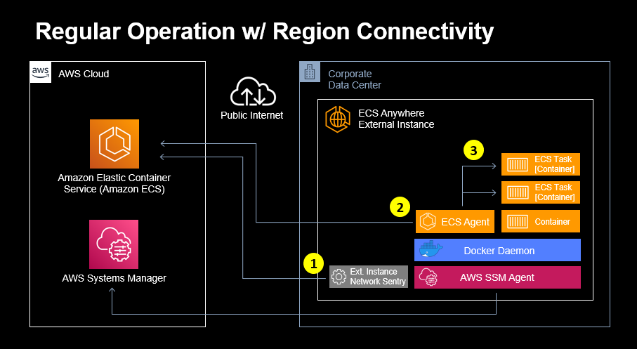
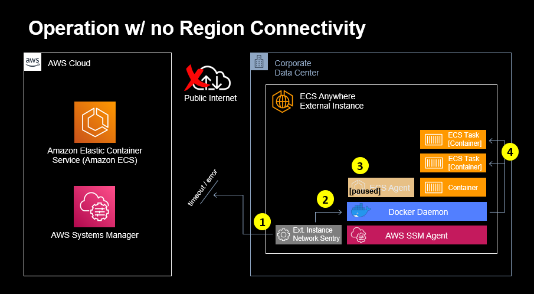

# ECS External Instance Network Sentry

## Introduction
This repository contains the application source code and end-user guide for configuring and deploying the ECS External Instance Network Sentry (eINS).

The eINS has been designed to provide an additional layer of resilience for ECS external instances in deployment scenarios where connectivity to the on-region ECS control-plane may be unreliable or intermittent.

Deploying the eINS to ECS external instances will ensure that during periods where there is a loss of connectivity to the on-region ECS control-plane, any ECS managed containers will be restarted if:
 - the container exits due to an error, which manifests as a non-zero exit code;
 - the Docker daemon is restarted, or;
 - the external instance is rebooted.

## Background

ECS Anywhere is an extension of Amazon ECS that will allow customers to deploy native Amazon ECS tasks in any environment. This includes the existing model on AWS managed infrastructure, as well as customer-managed infrastructure.

When extending ECS to customer managed infrastructure, external instances are registered to the ECS cluster. External instances are compute resources (hosts) external to an AWS region where ECS can schedule tasks to run. External instances are typically an on-premises server or virtual machine (VM).

During normal operation, where there is network connectivity between an ECS external instance and the on-region ECS control-plane - ECS monitors for errors or failures that occur to managed containers running on external instances and will restart any containers which have stopped due to an error.

For the duration of time that an ECS external instance loses network connectivity to the ECS on-region control-plane, any managed containers which have stopped due to an error will not be restarted by ECS until the point in time that network connectivity to the ECS on-region control-plane has been restored.

The eINS has been designed to detect any loss of connectivity to the on-region ECS control-plane, and to proactively ensure that for the duration of the outage that ECS managed containers which stop due to an error condition, Docker daemon restart, or external instance reboot are automatically restarted.

## Overview
The eINS is a Python application which can either be run manually, or be configured to run as a service on ECS Anywhere external instances. *See the [Installation](#Installation) section below for instruction for both deployment scenarios.*

### Connected Operation

The eINS periodically attempts to establish a TLS connection with the ECS on-region control-plane to determine region availability status, and the on-region ECS control-plane responds without error.



In reference to the diagram:

- eINS TLS connection with the ECS on-region control-plane [1] completes successfully:
  - eINS takes no further action.
- In communication with the on-region control-plane [2] the ECS agent on the external instance orchestrates local managed container lifecycle, including restarting containers which exit due to error condition [3]. 

### Disconnected Operation

The eINS periodically attempts to establish a TLS connection with the ECS on-region control-plane to determine region availability status, and the on-region ECS control-plane either does not respond, or returns an error.



In reference to the diagram:

- eINS TLS connection with the ECS on-region control-plane [1] experiences timeout or return error condition:
  - The ECS agent is paused [3] via the local Docker API [2]*.
  - eINS updates Docker restart policy updated to `on-failure` for each ECS managed container [4]. This ensures that any ECS managed containers will be restarted if exiting due to error, the Docker daemon is restarted, or the external instance is rebooted.

- When the ECS control-plane becomes reachable:
  - ECS managed containers that have been automatically restarted by the Docker daemon during network outage are stopped and removed.**
  - ECS managed containers that have not been automatically restarted during network outage have their Docker restart policy set back to `no`.
  - The local ECS agent is un-paused.

    > *At this point the operational environment has been restored back to the [Connected Operation](#Connected-Operation) scenario. eINS will continue to monitor for network outage or ECS control-plane error.*

#### Notes

*ECS agent is paused, as if left in a running state the agent will detect and kill ECS managed containers that have been restarted by the Docker daemon during the period of network outage.

**These containers are stopped and removed by eINS to avoid duplication:

- Containers that have been restarted by the Docker daemon during a network outage become orphaned by ECS once back online.
- The related ECS tasks are re-launched by ECS on the external instance once the ECS agent has established communication with the control-plane.

### Configuration Parameters

The eINS provides the ability to submit configuration parameters as command line arguments. Running the application with the `--help` parameter generates a summary of available parameters:

```bash
$ python3 ecs-external-instance-network-sentry.py --help
usage: ecs-external-instance-network-sentry [-h] -r REGION [-i INTERVAL] [-n RETRIES] [-l LOGFILE] [-k LOGLEVEL]

Purpose:
--------------
For use on ECS Anywhere external hosts:
Configures ECS orchestrated containers to automatically restart
on failure when on-region ecs control-plane is detected to be unreachable.

Configuration Parameters:
--------------
  -h, --help            Show this help message and exit.
  -r REGION, --region REGION
                        AWS region where ecs cluster is located.
  -i INTERVAL, --interval INTERVAL
                        Interval in seconds sentry will sleep between connectivity checks.
  -n RETRIES, --retries RETRIES
                        Number of times Docker will restart a crashing container.
  -l LOGFILE, --logfile LOGFILE
                        Logfile name & location.
  -k LOGLEVEL, --loglevel LOGLEVEL
                        Log data event severity.
```

Configuration parameters are described in further detail following:

##### `--region`

Provide the name of the AWS region where the ECS cluster that manages the external instance is hosted. eINS will attempt to establish a TLS connection to the ECS public endpoint at the nominated region to evaluate ECS control-plane availability.

- optional=no

- default=""

```bash
$ python3 ecs-external-instance-network-sentry.py --region ap-southeast-2
```

##### `--interval`

Specify the number of seconds between connectivity tests.

- optional=yes

- default=20

```bash
$ python3 ecs-external-instance-network-sentry.py --region ap-southeast-2 --interval 15
```

##### `--retries`

Specify the number of times failing containers will be restarted during periods where the ECS control-plane is unavailable. The default setting is `0` which configures the Docker daemon to restart containers an unlimited number of times.

- optional=yes

- default=0

```bash
$ python3 ecs-external-instance-network-sentry.py --region ap-southeast-2 --interval 15 --retries 5
```

##### `--logfile`

Specify logfile name and file-system path. The default value is  /tmp/ecs-anywhere-network-sentry.log.

- optional=yes

- default=/tmp/ecs-external-instance-network-sentry.log

```bash
$ python3 ecs-external-instance-network-sentry.py --region ap-southeast-2 --interval 15 --retries 5 --logfile /mypath/myfile.log
```

##### `--loglevel`

Specify log data event severity.

- optional=yes

- default=INFO

```bash
$ python3 ecs-external-instance-network-sentry.py --region ap-southeast-2 --interval 15 --retries 5 --logfile /mypath/myfile.log --loglevel DEBUG
```

## Installation

It's recommended that the external instance first be registered with ECS before installing the eINS. Installation instructions for eINS are provided below in the correct order of precedence.

> *Commands provided assume that the external instance host operating system is Ubuntu 20.*

### Prerequisites

#### ECS Anywhere

For each external instance you register with an Amazon ECS cluster, it requires the SSM Agent, the Amazon ECS container agent, and Docker installed. To register the external instance to an Amazon ECS cluster, it must first be registered as an AWS Systems Manager managed instance. You can generate the comprehensive installation script in a few clicks on the Amazon ECS console. Follow the instructions as described [here](https://docs.aws.amazon.com/AmazonECS/latest/developerguide/ecs-anywhere-registration.html).

#### Python

The eINS has been developed and tested running on Python version 3.8.10.

#### Python Docker SDK

The eINS interacts with the Docker API, which requires installation of the Python Docker SDK on each external instance where the eINS will run. To install the Python Docker SDK, run the commands as follows:

```bash
# update package index files..
$ apt get update
# install python docker sdk..
$ python3 pip install docker
```

#### Clone the 'ecs-external-instance-network-sentry' git repository

On the ECS external instance, clone the ecs-external-instance-network-sentry repository:

``` bash
# clone eins git repo..
$ git clone https://github.com/aws-samples/ecs-external-instance-network-sentry.git
```

> *Commands from this point forward will assume that you are in the root directory of the local git repository clone.*

### Manual Operation

At this point the external instance host operating system is ready to run the eINS. For testing or evaluation the application can be launched manually.

The application is located within the `/python` directory of the git repository. See the [Configuration Parameters](#Configuration-Parameters) section for required and optional parameters to be submitted at runtime. Remember to provide the correct AWS region code:

```bash
# manual launch..
$ python3 python/ecs-external-instance-network-sentry.py --region ap-southeast-2
```

### Background Service

Configuring the application as an OS background service is an effective mechanism to ensure that  the eINS remains running in the background at all times.

Service configuration requires the implementation of a unit configuration file which encodes information about the process that will be controlled and supervised by systemd. 

#### Configuration Procedure

##### Copy application and configuration files

Run the following commands to copy application and configuration files to the appropriate locations on the external instance file system:

```bash
# copy eins application file..
$ cp python/ecs-external-instance-network-sentry.py /usr/bin
# copy eins service unit config file..
$ cp config/ecs-external-instance-network-sentry.service /lib/systemd/system
```

##### Update service unit configuration file

Next, update the service unit configuration file `/lib/systemd/system/ecs-external-instance-network-sentry.service`. 

```bash
$ cat /lib/systemd/system/ecs-external-instance-network-sentry.service

[Unit]
Description=Amazon ECS External Instance Network Service
Documentation=https://github.com/aws-samples/ecs-external-instance-network-sentry
Requires=docker.service
After=ecs.service

[Service]
Type=simple
Restart=on-failure
RestartSec=10s
ExecStart=python3 /usr/bin/ecs-external-instance-network-sentry.py --region <INSERT-REGION-NAME-HERE>
[Install]
WantedBy=multi-user.target
```

Make necessary modifications to the service unit config file `ExecStart` directive on line-11 as follows:

- Update the `--region` configuration parameter with the AWS region name where your on-region ECS cluster is provisioned.
- Optionally, include any additional [Configuration Parameters](#Configuration-Parameters) to suit the particular requirements of your deployment scenario.

##### Configure and start service

```bash
# reload systemd..
$ systemctl daemon-reload
# enable eins service..
$ sudo systemctl enable ecs-external-instance-network-sentry.service
# start eins service..
$ systemctl start ecs-external-instance-network-sentry
```

##### Check service status

To validate that the service has started successfully, run the following command. If the service has started correctly, the output should be similar to the following:

```bash
$ systemctl status ecs-external-instance-network-sentry

● ecs-external-instance-network-sentry.service - Amazon ECS External Instance Network Service
     Loaded: loaded (/lib/systemd/system/ecs-external-instance-network-sentry.service; enabled; vendor preset: enabled)
     Active: active (running) since Fri 2021-07-30 07:57:08 UTC; 22min ago
       Docs: https://github.com/aws-samples/ecs-external-instance-network-sentry
   Main PID: 28366 (python3)
      Tasks: 1 (limit: 9412)
     Memory: 19.7M
     CGroup: /system.slice/ecs-external-instance-network-sentry.service
             └─28366 /usr/bin/python3 /usr/bin/ecs-external-instance-network-sentry.py --region ap-southeast-2 --interval 10 --retries 3 --logfile /tmp/ecs->

Jul 30 07:57:08 ubu20 systemd[1]: Started Amazon ECS External Instance Network Service.
```

## Logging

The eINS has been configured to provide basic logging regarding it's operation. 

The default logfile location is `/tmp/ecs-external-instance-network-sentry.log`, which can be modified by submitting the `--logfile` configuration parameter.

### Log Level

By default, the loglevel is set to `logging.INFO` and can be updated at runtime using the `--loglevel` configuration parameter.

### Log Output

The following eINS logfile excerpt illustrates;

- A detected loss of connectivity to on-region control-plane, and associated Docker policy configuration actions for ECS managed containers.
- Container cleanup and Docker policy configuration once ECS control-plane becomes reachable.

``` Bash
2021-07-10 09:00:01,200 INFO PID_713928 [startup] ecs-external-instance-network-sentry - starting..
2021-07-10 09:00:01,200 INFO PID_713928 [startup] arg - aws region: ap-southeast-2
2021-07-10 09:00:01,200 INFO PID_713928 [startup] arg - interval: 10
2021-07-10 09:00:01,201 INFO PID_713928 [startup] arg - retries: 0
2021-07-10 09:00:01,201 INFO PID_713928 [startup] arg - logfile: /tmp/ecs-external-instance-network-sentry.log
2021-07-10 09:00:01,201 INFO PID_713928 [startup] arg - loglevel: logging.INFO
...
...
2021-07-10 09:39:33,756 INFO PID_713928 [begin] connectivity test..
2021-07-10 09:39:33,757 INFO PID_713928 [connect] connecting to ecs at ap-southeast-2..
2021-07-10 09:39:33,757 INFO PID_713928 [connect] create network socket..
2021-07-10 09:39:43,764 ERROR PID_713928 [connect] error creating network socket: [Errno -3] Temporary failure in name resolution
2021-07-10 09:39:43,764 INFO PID_713928 [connect] connecting to host..
2021-07-10 09:39:43,765 INFO PID_713928 [ecs-offline] ecs unreachable, configuring container restart policy..
2021-07-10 09:39:43,880 INFO PID_713928 [ecs-offline] container name: ecs-alpine-crash-test-9adba798f5f189968701
2021-07-10 09:39:43,881 INFO PID_713928 [ecs-offline] ecs cluster: ecs-anywhere-cluster-1
2021-07-10 09:39:43,882 INFO PID_713928 [ecs-offline] set container restart policy: {'Name': 'on-failure', 'MaximumRetryCount': 0}
2021-07-10 09:39:43,958 INFO PID_713928 [ecs-offline] container name: ecs-nginx-1-nginx-eaa6e7a9b0cd88988201
2021-07-10 09:39:43,959 INFO PID_713928 [ecs-offline] ecs cluster: ecs-anywhere-cluster-1
2021-07-10 09:39:43,959 INFO PID_713928 [ecs-offline] set container restart policy: {'Name': 'on-failure', 'MaximumRetryCount': 0}
2021-07-10 09:39:44,022 INFO PID_713928 [ecs-offline] ecs agent paused..
2021-07-10 09:39:44,022 INFO PID_713928 [end] sleeping for 10 seconds..
...
...
2021-07-10 09:41:14,298 INFO PID_713928 [begin] connectivity test..
2021-07-10 09:41:14,299 INFO PID_713928 [connect] connecting to ecs at ap-southeast-2..
2021-07-10 09:41:14,299 INFO PID_713928 [connect] create network socket..
2021-07-10 09:41:23,133 INFO PID_713928 [connect] connecting to host..
2021-07-10 09:41:23,258 INFO PID_713928 [connect] send/receive data..
2021-07-10 09:41:30,563 INFO PID_713928 [connect] ecs at ap-southeast-2 is available..
2021-07-10 09:41:30,564 INFO PID_713928 [ecs-online] ecs is reachable..
2021-07-10 09:41:30,621 INFO PID_713928 [ecs-online] container name: ecs-alpine-crash-test-9adba798f5f189968701
2021-07-10 09:41:30,621 INFO PID_713928 [ecs-online] ecs cluster: ecs-anywhere-cluster-1
2021-07-10 09:41:30,622 INFO PID_713928 [ecs-online] container has been restarted by docker, stopping & removing..
2021-07-10 09:41:41,330 INFO PID_713928 [ecs-online] container name: ecs-nginx-1-nginx-eaa6e7a9b0cd88988201
2021-07-10 09:41:41,330 INFO PID_713928 [ecs-online] ecs cluster: ecs-anywhere-cluster-1
2021-07-10 09:41:41,331 INFO PID_713928 [ecs-online] set container restart policy: {'Name': 'no', 'MaximumRetryCount': 0}
2021-07-10 09:41:41,470 INFO PID_713928 [ecs-online] ecs agent unpaused..
2021-07-10 09:41:41,471 INFO PID_713928 [end] sleeping for 10 seconds..
```

### Log Rotation

Logfile will rotate at 5Mb and a history of the five most recent logfiles will be maintained.

## Considerations

The eINS currently has the following limitations:

 - During periods where the ECS control-plane is unavailable, and there is either an external instance OS reboot or Docker daemon restart: eINS will not start previously running ECS managed containers.
 - As described in the [Disconnected Operation](#Disconnected-Operation) section, containers that have been restarted during a period where the ECS control-plane is unavailable will be stopped once the ECS control-plane becomes available.

## Security

See [CONTRIBUTING](CONTRIBUTING.md#security-issue-notifications) for more information.

## License

This library is licensed under the MIT-0 License. See the LICENSE file.
